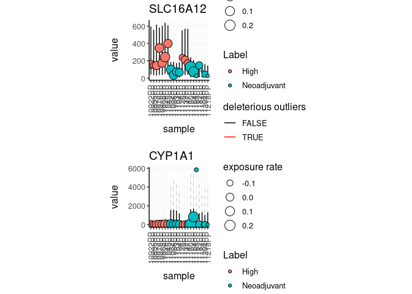

Posterior predictive check for bulk RNA sequencing data
================

The input data set is a tidy representation of a differential gene
transcript abundance analysis

To install:

For linux systems, in order to exploit multi-threading, from R write:

Then, install with

You can get the test dataset with

``` r
ppcSeq::counts 
```

You can convert a list of BAM/SAM files into a tidy data frame of
annotated counts

``` r
counts.ppc = 
    ppcSeq::counts %>%
    mutate(is_significant = FDR < 0.01) %>%
    ppc_seq(
        formula = ~ Label,
        significance_column = PValue,
        do_check_column = is_significant,
        value_column = value,
        percent_false_positive_genes = "5%"
    )
```

    ## executing do_inference
    ## Chain 1: ------------------------------------------------------------
    ## Chain 1: EXPERIMENTAL ALGORITHM:
    ## Chain 1:   This procedure has not been thoroughly tested and may be unstable
    ## Chain 1:   or buggy. The interface is subject to change.
    ## Chain 1: ------------------------------------------------------------
    ## Chain 1: 
    ## Chain 1: 
    ## Chain 1: 
    ## Chain 1: Gradient evaluation took 0.01 seconds
    ## Chain 1: 1000 transitions using 10 leapfrog steps per transition would take 100 seconds.
    ## Chain 1: Adjust your expectations accordingly!
    ## Chain 1: 
    ## Chain 1: 
    ## Chain 1: Begin eta adaptation.
    ## Chain 1: Iteration:   1 / 250 [  0%]  (Adaptation)
    ## Chain 1: Iteration:  50 / 250 [ 20%]  (Adaptation)
    ## Chain 1: Iteration: 100 / 250 [ 40%]  (Adaptation)
    ## Chain 1: Iteration: 150 / 250 [ 60%]  (Adaptation)
    ## Chain 1: Iteration: 200 / 250 [ 80%]  (Adaptation)
    ## Chain 1: Success! Found best value [eta = 1] earlier than expected.
    ## Chain 1: 
    ## Chain 1: Begin stochastic gradient ascent.
    ## Chain 1:   iter             ELBO   delta_ELBO_mean   delta_ELBO_med   notes 
    ## Chain 1:    100      -176362.543             1.000            1.000
    ## Chain 1:    200      -119881.767             0.736            1.000
    ## Chain 1:    300       -81615.148             0.647            0.471
    ## Chain 1:    400       -71800.446             0.519            0.471
    ## Chain 1:    500       -70692.610             0.418            0.469
    ## Chain 1:    600       -70567.208             0.349            0.469
    ## Chain 1:    700       -70585.313             0.299            0.137
    ## Chain 1:    800       -70537.263             0.262            0.137
    ## Chain 1:    900       -70503.080             0.233            0.016
    ## Chain 1:   1000       -70502.024             0.210            0.016
    ## Chain 1:   1100       -70490.978             0.191            0.002   MEDIAN ELBO CONVERGED
    ## Chain 1: 
    ## Chain 1: Drawing a sample of size 1000 from the approximate posterior... 
    ## Chain 1: COMPLETED.
    ## executing fit_to_counts_rng
    ## executing save_generated_quantities_in_case
    ## executing check_if_within_posterior
    ## executing add_exposure_rate
    ## executing do_inference
    ## Chain 1: ------------------------------------------------------------
    ## Chain 1: EXPERIMENTAL ALGORITHM:
    ## Chain 1:   This procedure has not been thoroughly tested and may be unstable
    ## Chain 1:   or buggy. The interface is subject to change.
    ## Chain 1: ------------------------------------------------------------
    ## Chain 1: 
    ## Chain 1: 
    ## Chain 1: Rejecting initial value:
    ## Chain 1:   Log probability evaluates to log(0), i.e. negative infinity.
    ## Chain 1:   Stan can't start sampling from this initial value.
    ## Chain 1: 
    ## Chain 1: Gradient evaluation took 0.02 seconds
    ## Chain 1: 1000 transitions using 10 leapfrog steps per transition would take 200 seconds.
    ## Chain 1: Adjust your expectations accordingly!
    ## Chain 1: 
    ## Chain 1: 
    ## Chain 1: Begin eta adaptation.
    ## Chain 1: Iteration:   1 / 250 [  0%]  (Adaptation)
    ## Chain 1: Iteration:  50 / 250 [ 20%]  (Adaptation)
    ## Chain 1: Iteration: 100 / 250 [ 40%]  (Adaptation)
    ## Chain 1: Iteration: 150 / 250 [ 60%]  (Adaptation)
    ## Chain 1: Iteration: 200 / 250 [ 80%]  (Adaptation)
    ## Chain 1: Success! Found best value [eta = 1] earlier than expected.
    ## Chain 1: 
    ## Chain 1: Begin stochastic gradient ascent.
    ## Chain 1:   iter             ELBO   delta_ELBO_mean   delta_ELBO_med   notes 
    ## Chain 1:    100      -130082.771             1.000            1.000
    ## Chain 1:    200       -82441.517             0.789            1.000
    ## Chain 1:    300       -71767.073             0.576            0.578
    ## Chain 1:    400       -70673.450             0.436            0.578
    ## Chain 1:    500       -70565.221             0.349            0.149
    ## Chain 1:    600       -70506.693             0.291            0.149
    ## Chain 1:    700       -70510.393             0.249            0.015
    ## Chain 1:    800       -70455.811             0.218            0.015
    ## Chain 1:    900       -70463.090             0.194            0.002   MEDIAN ELBO CONVERGED
    ## Chain 1: 
    ## Chain 1: Drawing a sample of size 1050 from the approximate posterior... 
    ## Chain 1: COMPLETED.
    ## executing fit_to_counts_rng
    ## executing save_generated_quantities_in_case
    ## executing check_if_within_posterior
    ## executing add_exposure_rate

The new posterior predictive check has been added to the original data
frame

``` r
counts.ppc 
```

    ## # A tibble: 15 x 5
    ## # Groups:   symbol [15]
    ##    symbol  `sample wise dat… plot   `ppc samples fail… `tot deleterious ou…
    ##    <chr>     <list<df[,12]>> <list>              <int>                <int>
    ##  1 SLC16A…         [21 × 12] <gg>                    0                    0
    ##  2 CYP1A1          [21 × 12] <gg>                    1                    1
    ##  3 ART3            [21 × 12] <gg>                    0                    0
    ##  4 DIO2            [21 × 12] <gg>                    0                    0
    ##  5 OR51E2          [21 × 12] <gg>                    0                    0
    ##  6 MUC16           [21 × 12] <gg>                    0                    0
    ##  7 CCNA1           [21 × 12] <gg>                    0                    0
    ##  8 LYZ             [21 × 12] <gg>                    1                    1
    ##  9 PPM1H           [21 × 12] <gg>                    0                    0
    ## 10 SUSD5           [21 × 12] <gg>                    0                    0
    ## 11 TPRG1           [21 × 12] <gg>                    0                    0
    ## 12 EPB42           [21 × 12] <gg>                    0                    0
    ## 13 LRRC38          [21 × 12] <gg>                    0                    0
    ## 14 SUSD4           [21 × 12] <gg>                    0                    0
    ## 15 MMP8            [21 × 12] <gg>                    0                    0

The new data frame contains plots for each gene

We can visualise the top five differentially transcribed genes

``` r
counts.ppc %>% 
    slice(1:2) %>% 
    pull(plot) %>% 
    cowplot::plot_grid(plotlist = ., align = "v", ncol = 1, axis="b", rel_widths = 1 )
```

<!-- -->
