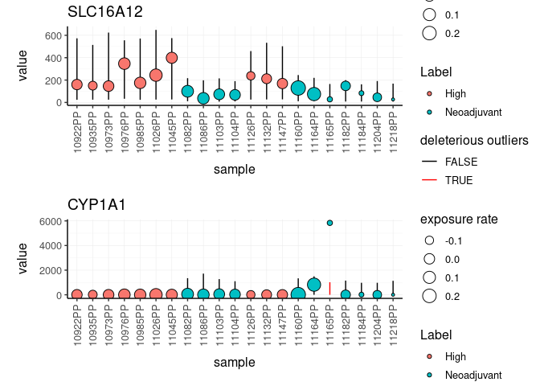

Posterior predictive check for bulk RNA sequencing data
================

The input data set is a tidy representation of a differential gene
transcript abundance analysis

To install:

For linux systems, in order to exploit multi-threading, from R write:

``` r
fileConn<-file("~/.R/Makevars")
writeLines(c( "CXX14FLAGS += -O3","CXX14FLAGS += -DSTAN_THREADS", "CXX14FLAGS += -pthread"), fileConn)
close(fileConn)
```

Then, install with

``` r
devtools::install_github("stemangiola/ppcSeq")
```

You can get the test dataset with

``` r
ppcSeq::counts 
```

You can convert a list of BAM/SAM files into a tidy data frame of
annotated counts

``` r
counts.ppc = 
    ppcSeq::counts %>%
    mutate(is_significant = FDR < 0.01) %>%
    ppc_seq(
        formula = ~ Label,
        significance_column = PValue,
        do_check_column = is_significant,
        value_column = value,
        percent_false_positive_genes = "5%"
    )
```

    ## [1] "2019-07-27 09:37:35 AEST"
    ## [1] "2019-07-27 09:39:18 AEST"
    ## [1] "2019-07-27 09:39:40 AEST"
    ## [1] "2019-07-27 09:42:43 AEST"

The new posterior predictive check has been added to the original data
frame

``` r
counts.ppc 
```

    ## # A tibble: 15 x 4
    ##    symbol   `sample wise data` plot   `tot deleterious outliers`
    ##    <chr>       <list<df[,11]>> <list>                      <int>
    ##  1 SLC16A12          [21 × 11] <gg>                            0
    ##  2 CYP1A1            [21 × 11] <gg>                            1
    ##  3 ART3              [21 × 11] <gg>                            0
    ##  4 DIO2              [21 × 11] <gg>                            0
    ##  5 OR51E2            [21 × 11] <gg>                            0
    ##  6 MUC16             [21 × 11] <gg>                            0
    ##  7 CCNA1             [21 × 11] <gg>                            0
    ##  8 LYZ               [21 × 11] <gg>                            1
    ##  9 PPM1H             [21 × 11] <gg>                            0
    ## 10 SUSD5             [21 × 11] <gg>                            0
    ## 11 TPRG1             [21 × 11] <gg>                            0
    ## 12 EPB42             [21 × 11] <gg>                            0
    ## 13 LRRC38            [21 × 11] <gg>                            0
    ## 14 SUSD4             [21 × 11] <gg>                            0
    ## 15 MMP8              [21 × 11] <gg>                            0

The new data frame contains plots for each gene

We can visualise the top five differentially transcribed genes

``` r
counts.ppc %>% 
    slice(1:2) %>% 
    pull(plot) %>% 
    cowplot::plot_grid(plotlist = ., align = "v", ncol = 1, axis="b", rel_widths = 1 )
```

<!-- -->
